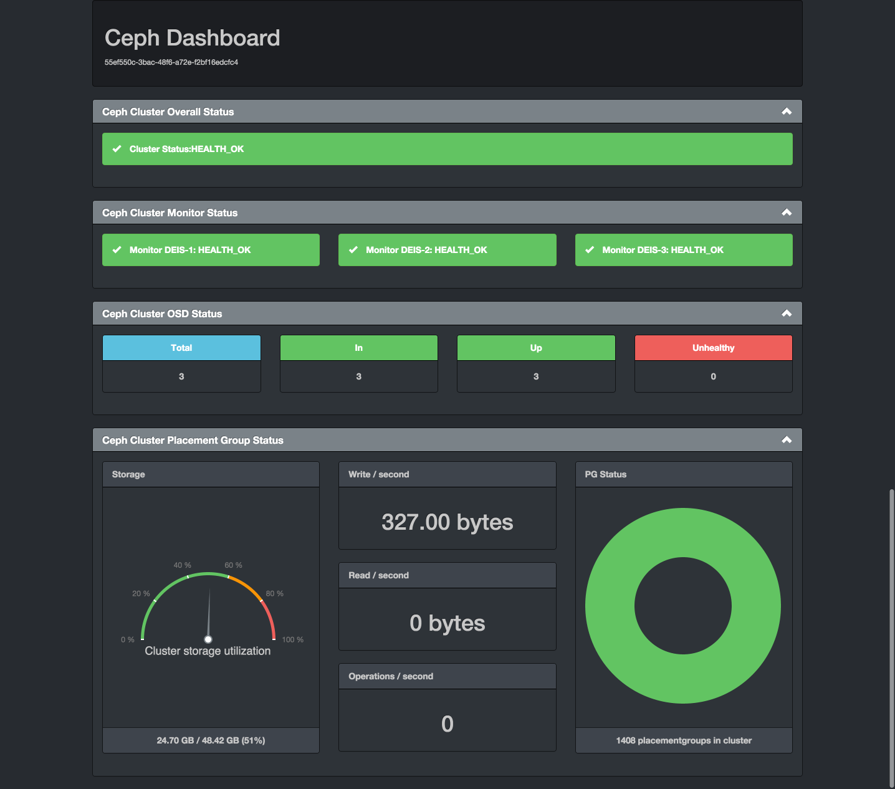

:title: Customizing store-dashboard
:description: Learn how to tune custom Deis settings.

.. _store_dashboard_settings:

Customizing store-dashboard
===========================

.. note::
    This is an optional component. Because of this is not integrated in deisctl.

About
-----
The store-dashboard is an optional component that provides an informational dashboard to show the status of 
the ceph cluster using `ceph-dash`_

`ceph-dash`_ is a wsgi application that uses librados (for python) to retrieve the status of the cluster.

Dependencies
------------
Requires: :ref:`store-daemon <store_daemon_settings>`

There is no persistence or any dependency to run the component besides be able to connect to the ceph cluster.

Installation:
-------------
Download `deis-store-dashboard.service`_ in any node in the cluster and execute:

.. code-block:: console

    $ fleetctl submit deis-store-dashboard.service
    $ fleetctl start deis-store-dashboard.service

.. note::

  To access the dashboard open a browser in http://deis-store-dashboard.local3.deisapp.com 
  or replace .local3.deisapp.com with your configured domain in the `installation step`_)

Screenshot
----------

.. _`stock store-dashboard image`: https://github.com/deis/deis/tree/master/store/dashboard
.. _`deis-store-dashboard.service`: https://github.com/deis/deis/tree/master/store/dashboard/deis-store-dashboard.service
.. _`ceph-dash`: https://github.com/Crapworks/ceph-dash
.. _`installation step`: http://docs.deis.io/en/latest/installing_deis/install-platform/#install-deis-platform
